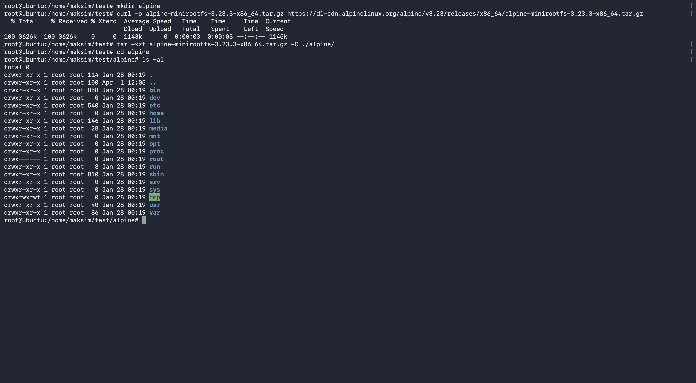
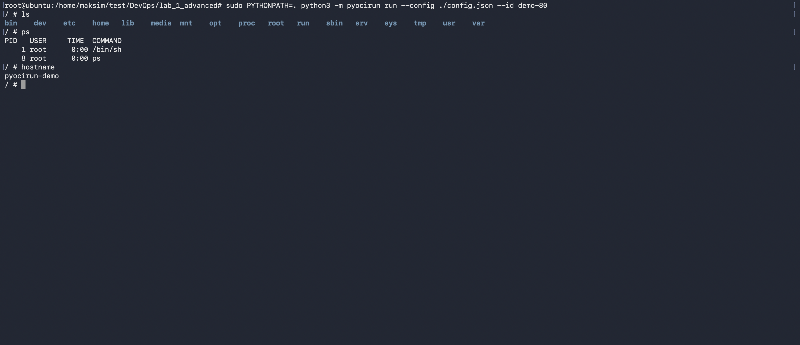
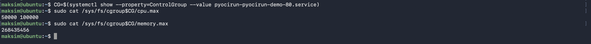
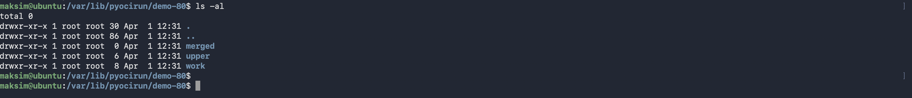
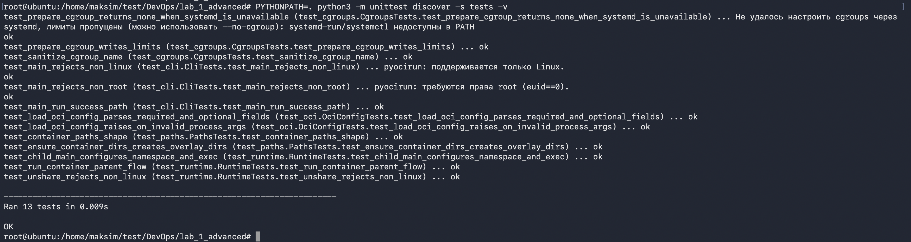

# Отчёт по лабораторной работе: запуск команды в контейнере

## 1. Цель работы

Целью работы было реализовать утилиту `pyocirun` на Python, которая запускает процесс в изолированном окружении по `OCI config.json` с использованием namespaces, `overlayfs` и `chroot`. Дополнительно требовалось поддержать ограничение ресурсов через cgroups и монтирование `/proc` внутри контейнера.

## 2. Постановка задачи

В рамках задания необходимо было обеспечить:

1. запуск команды в контейнере;
2. конфигурацию через `config.json` в формате OCI Runtime;
3. создание новых `PID`, `Mount`, `UTS` namespaces;
4. установку `hostname` из поля `hostname` конфига;
5. создание каталога состояния `/var/lib/{utility_name}/{id}`;
6. запуск rootfs через `overlayfs`:
   - `lowerdir` — базовый rootfs (Alpine),
   - `upperdir` — `/var/lib/{utility_name}/{id}/upper`,
   - `workdir` — `/var/lib/{utility_name}/{id}/work`,
   - `merged` — `/var/lib/{utility_name}/{id}/merged`;
7. запуск целевой команды как `PID 1` в контейнере и ожидание её завершения в foreground;
8. опционально: cgroups (CPU/Memory/IO) и монтирование `/proc`.

## 3. Реализованное решение

### 3.1 Основные модули проекта

- `pyocirun/cli.py` — CLI, разбор параметров, запуск сценария `run`.
- `pyocirun/oci.py` — загрузка и валидация `config.json`.
- `pyocirun/paths.py` — построение путей `/var/lib/{name}/{id}` и директорий overlay.
- `pyocirun/runtime.py` — основной runtime (`unshare`, `fork`, `overlay`, `chroot`, `exec`).
- `pyocirun/mount.py` — вспомогательные операции `mount/umount`.
- `pyocirun/cgroups_v2.py` — применение ограничений cgroup v2.

### 3.2 Алгоритм запуска контейнера

1. Считать `config.json` и проверить обязательные поля (`root.path`, `process.args`).
2. Подготовить рабочие директории в `/var/lib/{utility_name}/{id}`.
3. При наличии `linux.resources` настроить cgroup v2.
4. Выполнить `unshare(CLONE_NEWNS | CLONE_NEWUTS | CLONE_NEWPID)`.
5. `fork()`:
   - в дочернем процессе: `sethostname`, `overlay mount`, `chroot`, опционально `mount /proc`, затем `execvpe`;
   - в родительском: прикрепить PID дочернего процесса к cgroup и ждать `waitpid`.

### 3.3 Реализация cgroups

В реализации используется cgroup v2 через systemd transient unit:

- создаётся unit через `systemd-run` с делегированием;
- путь cgroup определяется через `systemctl show ... ControlGroup`;
- лимиты записываются в `cpu.max`, `memory.max`, `io.max`;
- после завершения контейнера выполняется best-effort cleanup unit.

## 4. Условия запуска

- ОС: Linux;
- права: root (`euid == 0`);
- должен быть доступен `overlayfs`;
- для cgroups: доступные `systemd-run` и `systemctl`.

## 5. Демонстрация работы

Ниже команды, которые использовались для демонстрации.

### 5.1 Подготовка Alpine rootfs

```bash
mkdir alpine
curl -o alpine-minirootfs-3.23.3-x86_64.tar.gz https://dl-cdn.alpinelinux.org/alpine/v3.23/releases/x86_64/alpine-minirootfs-3.23.3-x86_64.tar.gz
tar -xzf alpine-minirootfs-3.23.3-x86_64.tar.gz -C ./alpine/
```




### 5.2 Запуск контейнера

```bash
sudo PYTHONPATH=. python3 -m pyocirun run --config ./config.json --id demo-80
```



### 5.3 Проверка cgroups

запустим на хосте

```bash
CG=$(systemctl show --property=ControlGroup --value pyocirun-pyocirun-demo-80.service)
sudo cat /sys/fs/cgroup$CG/cpu.max
sudo cat /sys/fs/cgroup$CG/memory.max
```



### 5.3 Проверка наличия директорий




## 6. Тестирование

Для проверки использовались unit-тесты:

```bash
PYTHONPATH=. python3 -m unittest discover -s tests -v
```



Тестами покрыты:

- парсинг OCI-конфига;
- формирование путей;
- основной runtime-поток запуска;
- применение cgroups;
- CLI-валидации.

## 7. Вывод

В ходе работы реализована утилита `pyocirun`, которая выполняет все ключевые требования задания: изоляцию через namespaces, запуск rootfs через `overlayfs`, корректный запуск команды как `PID 1`, работу в foreground, а также опциональные `cgroups` и `/proc`. Полученное решение пригодно для демонстрации базовых механизмов container runtime на Linux.
