# Отчет по лабораторной 2

## Что нужно было сделать

1. Поднять локальный кластер Kubernetes
2. Развернуть в нем свой сервис через 2-3 ресурса Kubernetes
3. Запустить все по возможности одной командой из yaml файлов
4. Показать что сервис реально работает
5. Сделать Helm chart
6. Задеплоить chart в кластер
7. Изменить сервис и выкатить новую версию через upgrade релиза

## Часть 1 - Kubernetes манифесты

Я поднял кластер через minikube и развернул простой nginx сервис с hello world страницей. Сделал это через отдельные yaml файлы и применил их одной командой

Использованные ресурсы Kubernetes
- Namespace - отдельное пространство для ресурсов
- ConfigMap - хранит html страницу и конфиг nginx
- Deployment - поднимает pod и следит чтобы сервис всегда работал
- Service - дает стабильный доступ к приложению внутри кластера

#### Команда запуска кластера

Команда поднимает локальный Kubernetes кластер в minikube на docker драйвере

```bash
minikube start --driver=docker
```
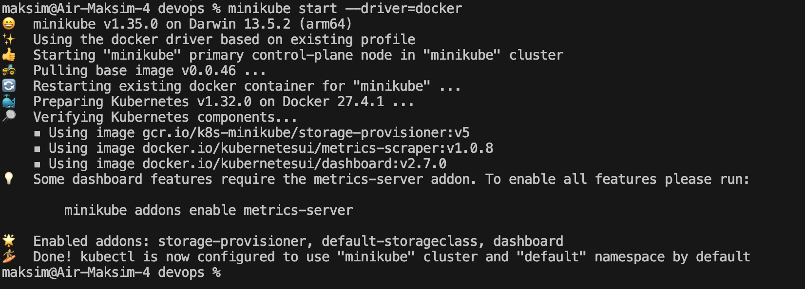

#### Команда деплоя всех манифестов одной командой

Команда применяет все yaml из папки `part_1` и создает ресурсы в кластере

```bash
kubectl apply -f lab_2_base/part_1
```
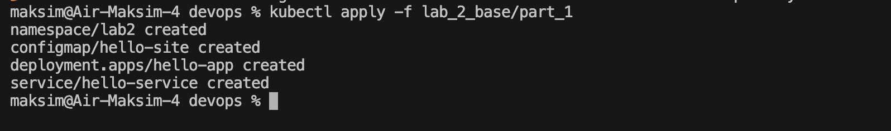

#### Проверка что деплой поднялся

Первая команда ждет успешный rollout deployment. Вторая проверяет что namespace `lab2` создан. Третья показывает pod, service, deployment и configmap в этом namespace

```bash
kubectl rollout status deployment/hello-app -n lab2 --timeout=120s
kubectl get ns lab2
kubectl get configmap,deploy,svc,pods -n lab2
```
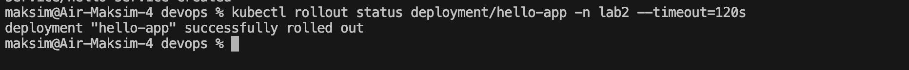
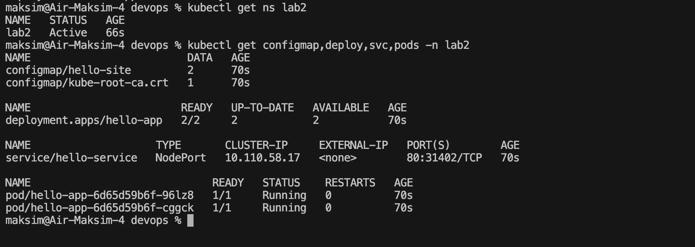

#### Проверка сервиса

`port-forward` запускается в первом терминале и держится активным во время проверки

`curl` выполняется во втором терминале и показывает ответ сервиса

```bash
# терминал 1
kubectl port-forward -n lab2 service/hello-service 8080:80

# терминал 2
curl -sS http://127.0.0.1:8080/ | head
```
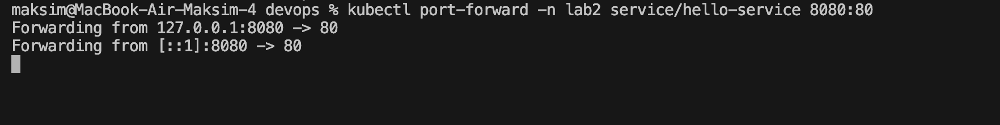
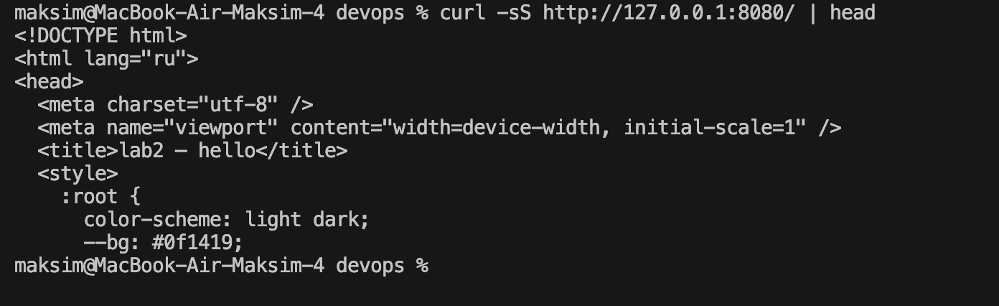

В браузере открывал `http://127.0.0.1:8080/`. Страница отдавалась корректно
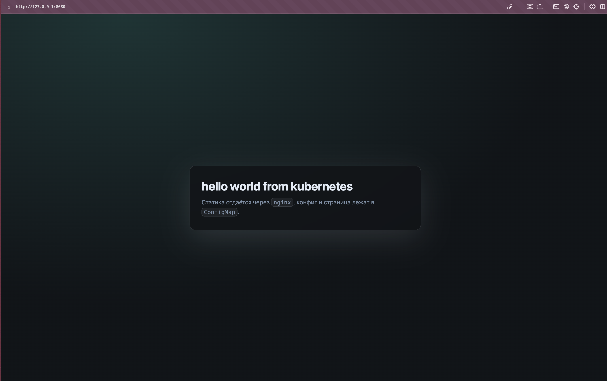

### Файлы части 1

| Файл | Что внутри | Зачем нужен |
| - | - | - |
| `part_1/00-namespace.yaml` | Описание namespace `lab2` | Для изоляции ресурсов лабораторной работы (префикс `00-` обеспечивает порядок при `kubectl apply -f` по каталогу) |
| `part_1/configmap.yaml` | `index.html` и конфиг nginx | Для хранения контента страницы и конфигурации nginx |
| `part_1/deployment.yaml` | Deployment `hello-app`, реплики, монтирование ConfigMap | Для запуска pod и поддержания нужного количества реплик |
| `part_1/service.yaml` | Service `hello-service` с доступом к pod | Для стабильного доступа к приложению по сетевому имени |

#### Очистка ресурсов части 1

Команда удаляет ресурсы части 1 из кластера по тем же манифестам

```bash
kubectl delete -f lab_2_base/part_1
```
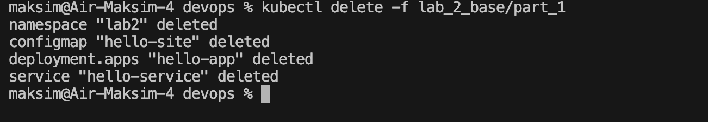

## Часть 2 - Helm chart

На основе этого же сервиса сделал Helm chart. Сначала задеплоил первую версию. Потом изменил контент страницы и обновил релиз через `helm upgrade`

### Файлы chart

| Файл | Что внутри | Зачем нужен |
| - | - | - |
| `part_2/helm/hello-service/Chart.yaml` | Имя chart, версия chart, `appVersion` | Для хранения метаинформации Helm chart |
| `part_2/helm/hello-service/values.yaml` | Базовые значения для первой версии | Для задания параметров релиза по умолчанию |
| `part_2/helm/hello-service/values-v2.yaml` | Измененные значения для второй версии | Для переопределения параметров при обновлении релиза |
| `part_2/helm/hello-service/templates/_helpers.tpl` | Общие шаблонные функции и имена | Для переиспользования имен и общих шаблонов |
| `part_2/helm/hello-service/templates/configmap.yaml` | Шаблон ConfigMap | Для генерации ConfigMap из значений values |
| `part_2/helm/hello-service/templates/deployment.yaml` | Шаблон Deployment | Для генерации Deployment с параметрами релиза |
| `part_2/helm/hello-service/templates/service.yaml` | Шаблон Service | Для генерации Service и публикации приложения в кластере |

#### Первый деплой релиза

Команда устанавливает Helm релиз `hello-v1`. Если релиз уже существует, выполняется обновление вместо новой установки

```bash
helm upgrade --install hello-v1 lab_2_base/part_2/helm/hello-service \
  --namespace lab2-helm \
  --create-namespace \
  -f lab_2_base/part_2/helm/hello-service/values.yaml
```
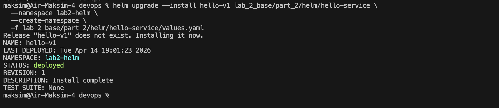

#### Проверка после установки

`helm list` показывает релиз в namespace

`kubectl get` показывает созданные ресурсы

`rollout status` подтверждает готовность deployment

```bash
helm list -n lab2-helm
kubectl get all,configmap -n lab2-helm
kubectl rollout status deployment/hello-v1-hello-service -n lab2-helm --timeout=120s
```
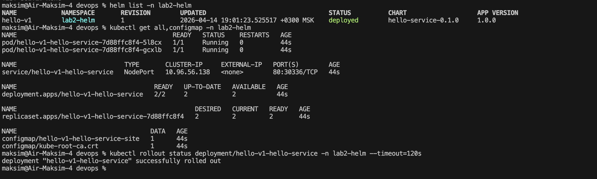

#### Проверка сервиса версии v1

`port-forward` запускается в первом терминале и открывает локальный порт `8080`

`curl` во втором терминале показывает контент версии v1

```bash
# терминал 1
kubectl port-forward svc/hello-v1-hello-service 8080:80 -n lab2-helm

# терминал 2
curl -sS http://127.0.0.1:8080 | head -n 20
```
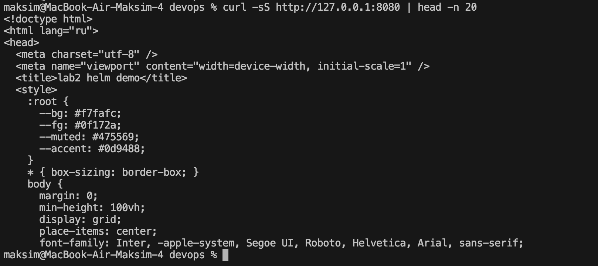
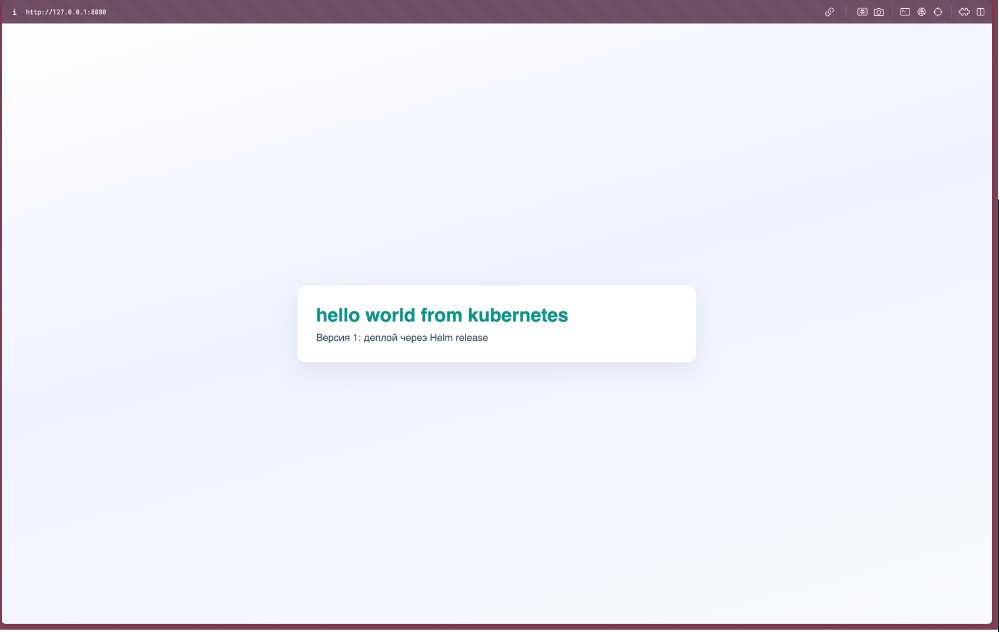

#### Апгрейд релиза на версию v2

Команда обновляет тот же релиз. Базовые параметры берутся из `values.yaml`, изменения версии v2 из `values-v2.yaml`

```bash
helm upgrade hello-v1 lab_2_base/part_2/helm/hello-service \
  --namespace lab2-helm \
  -f lab_2_base/part_2/helm/hello-service/values.yaml \
  -f lab_2_base/part_2/helm/hello-service/values-v2.yaml
```
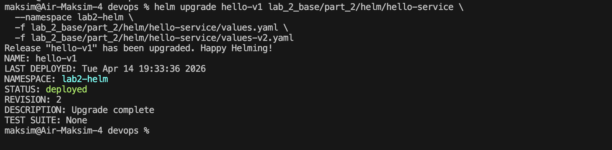

#### Проверка после upgrade

`helm history` показывает ревизии релиза после обновления

`helm status` показывает текущее состояние релиза

`rollout status` подтверждает успешный выкат новой версии

```bash
helm history hello-v1 -n lab2-helm
helm status hello-v1 -n lab2-helm
kubectl rollout status deployment/hello-v1-hello-service -n lab2-helm --timeout=120s
```
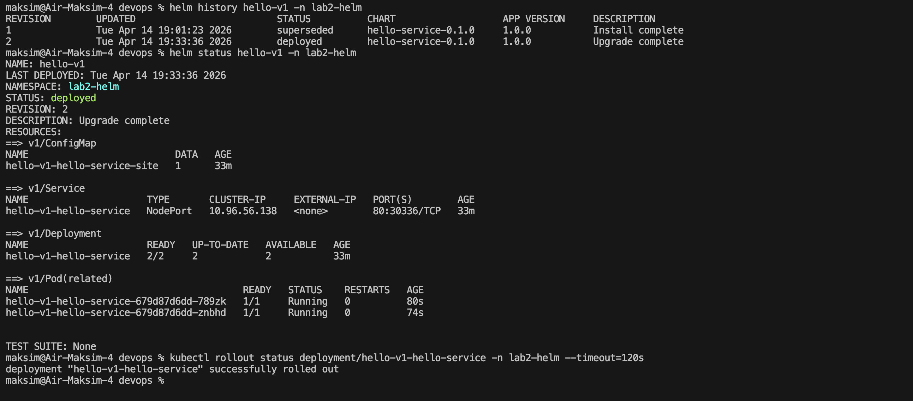

#### Проверка сервиса версии v2

`port-forward` снова открывает доступ к сервису на локальный порт

`curl` показывает уже обновленный контент версии v2

```bash
# терминал 1
kubectl port-forward svc/hello-v1-hello-service 8080:80 -n lab2-helm

# терминал 2
curl -sS http://127.0.0.1:8080 | head -n 20
```
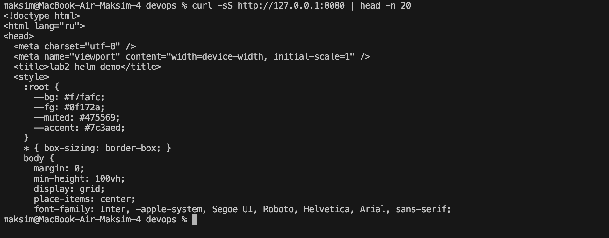
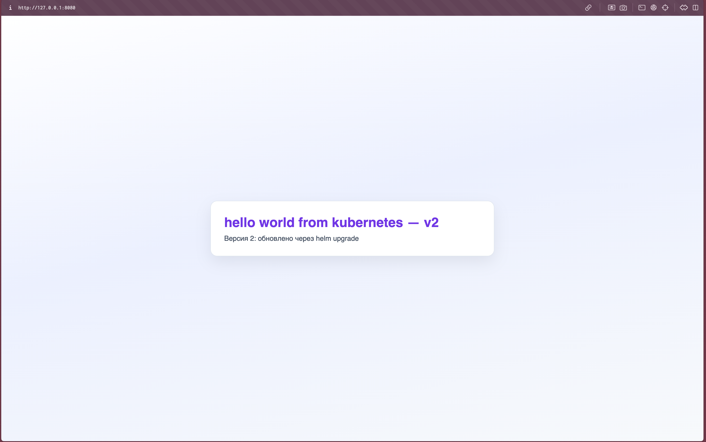

## Почему Helm удобнее чем обычные манифесты

1. Меньше копипаста, так как все меняется через values файлы, не нужно держать много почти одинаковых yaml

2. Удобно обновлять и откатывать, так как у релиза есть история версий, можно смотреть ревизии и при необходимости откатиться

3. Один понятный процесс деплоя. `helm upgrade --install` закрывает и установку и обновление, меньше ручных шагов и ошибок