# Лабораторная 3 Advanced Mini SaaS для MinIO

## О чем проект

В этой лабораторной я собрал мини SaaS который поднимает отдельные S3 совместимые хранилища на базе MinIO

Идея простая - пользователь создает инстанс и сразу получает рабочее хранилище со своими ключами и endpoint

Внутри проекта

- backend на `FastAPI` для API и бизнес логики
- frontend на `HTML CSS JS` для управления через браузер
- `PostgreSQL` для хранения метаданных инстансов
- `Docker Compose` для запуска всей системы одной командой

Что уже умеет система

- создавать отдельный MinIO инстанс
- выдавать `Access Key` и `Secret Key`
- запускать останавливать и удалять инстанс
- показывать детали инстанса и список бакетов
- создавать бакеты
- получать список объектов
- генерировать presigned URL для загрузки файла

## Архитектура

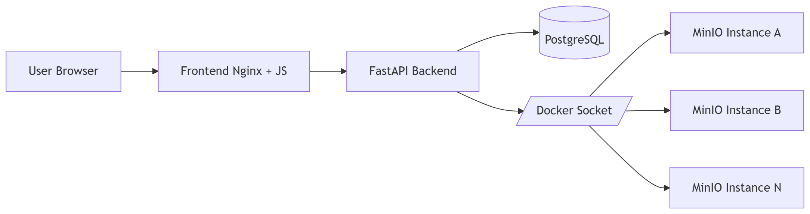

### Состав проекта

- `frontend/`
  - `index.html` основной интерфейс и модальные окна
  - `app.js` клиентская логика, вызовы API и работа с detail view
  - `styles.css` стили и адаптация под экран
- `backend/`
  - `main.py` REST API и сценарии работы
  - `docker_manager.py` управление контейнерами через Docker SDK
  - `storage_manager.py` операции с бакетами объектами и presigned URL
  - `models.py`, `schemas.py`, `database.py` слой данных
- `docker-compose.yml`
  - сервисы `db`, `backend`, `frontend`

## Ключевые решения

### Изоляция инстансов

Каждый пользовательский инстанс запускается как отдельный контейнер MinIO. Для каждого инстанса задаются свои порты учетные данные и статус в БД

- уникальные host порты для API и Console
- отдельные root credentials
- отдельное имя контейнера и labels
- состояния `creating`, `running`, `stopped`, `error`

### Управление жизненным циклом

Через backend реализованы основные действия с контейнером

- создание инстанса
- запуск инстанса
- остановка инстанса
- удаление инстанса
- синхронизация статуса Docker и БД

### Работа с хранилищем

В detail view доступны операции со storage

- просмотр endpoint и credentials
- создание бакета
- просмотр объектов внутри бакета
- генерация presigned PUT URL
- готовая команда `curl` для загрузки

### Устойчивость и удобство

- обработка ошибок API на backend и frontend
- уведомления в интерфейсе при успешных и ошибочных действиях
- таймауты для клиентских запросов

### Версия MinIO

Используется фиксированный образ, так как последний не дает полного функционала

- `minio/minio:RELEASE.2025-04-22T22-12-26Z`


## API

### Инстансы

- `POST /api/instances` создать инстанс
- `GET /api/instances` получить список инстансов
- `GET /api/instances/{id}` получить один инстанс
- `POST /api/instances/{id}/start` запустить инстанс
- `POST /api/instances/{id}/stop` остановить инстанс
- `DELETE /api/instances/{id}` удалить инстанс

### Storage detail view

- `GET /api/instances/{id}/details` детали инстанса и список бакетов
- `POST /api/instances/{id}/buckets` создать бакет
- `GET /api/instances/{id}/buckets/{bucket}/objects` список объектов в бакете
- `POST /api/instances/{id}/buckets/{bucket}/presigned-upload` получить presigned PUT URL

## Как запустить

Перейти в директорию `lab_3_advanced` и выполнить

```bash
docker compose up -d --build
```

После запуска доступны адреса

- frontend `http://localhost:3000`
- backend API `http://localhost:8000`
- swagger `http://localhost:8000/api/docs`

Остановка проекта

```bash
docker compose down
```

## Пример загрузки файла через presigned URL

- открыть `Details` нужного инстанса
- создать или выбрать bucket
- указать `Object name`, например `configs/docker-compose.yml`
- нажать `Generate URL`
- выполнить команду

```bash
curl -X PUT --upload-file "./lab_3_advanced/docker-compose.yml" "<PRESIGNED_URL>"
```

## Что видно в мониторинге на главной

- общее количество инстансов
- количество running инстансов
- количество stopped инстансов
- суммарное число бакетов по доступным running инстансам

## Cкриншоты работы


### 1. Главный экран (Dashboard)

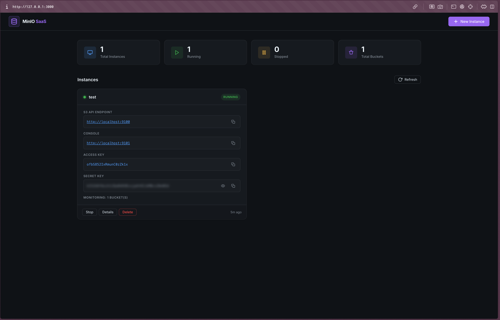

### 2. Создание инстанса

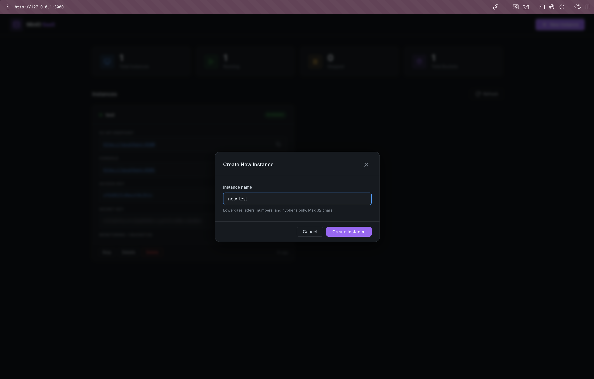

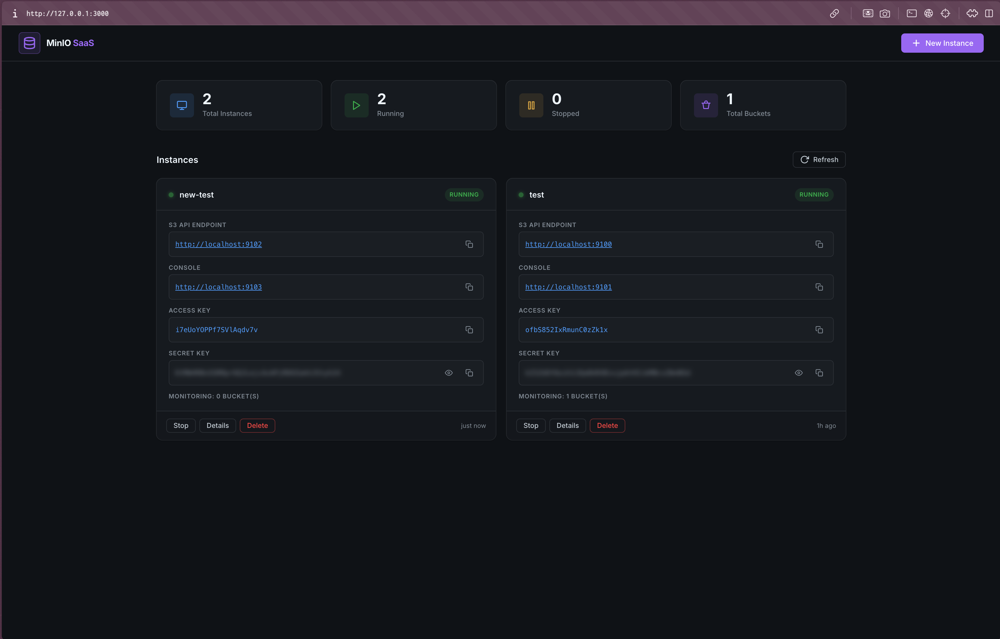

### 3. Детальный просмотр инстанса

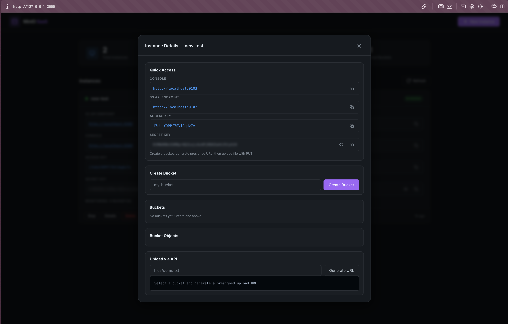

### 4. Создание бакета


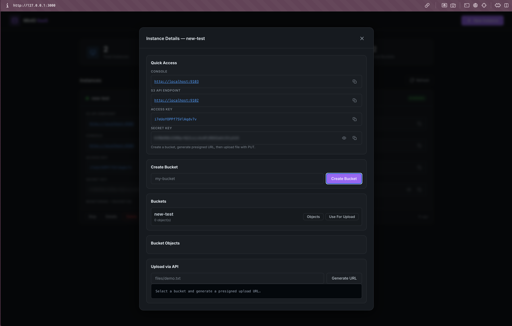

### 5. Генерация и использование presigned URL

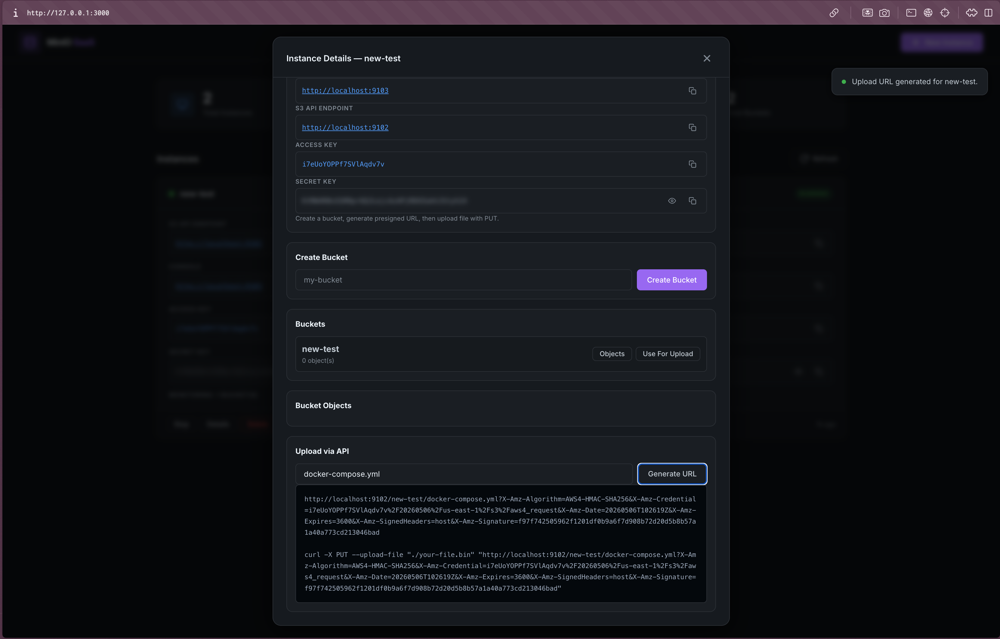

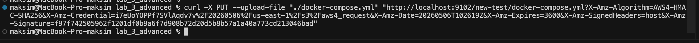

### 6. Просмотр объектов

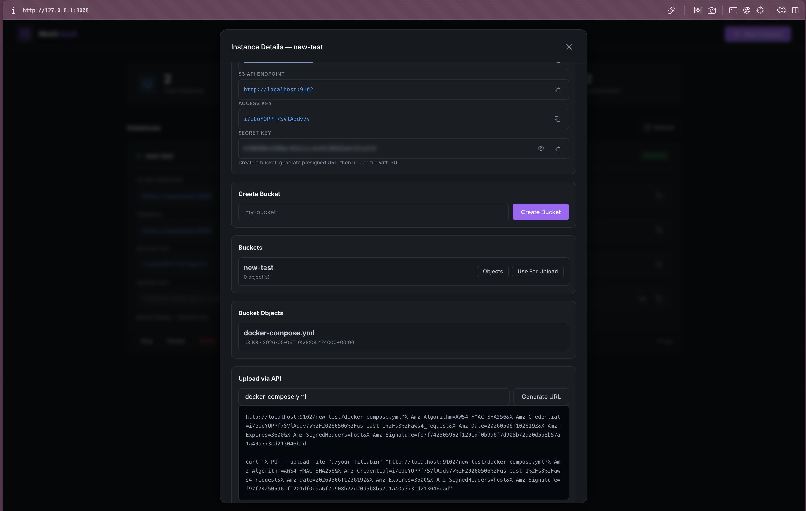

### 7. Проверка работоспособности

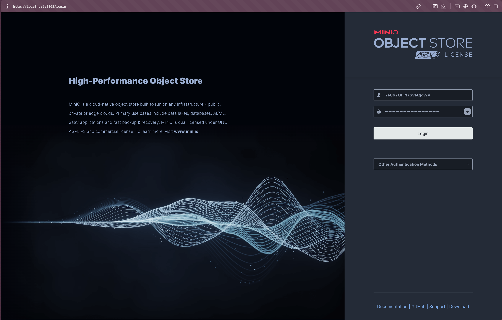

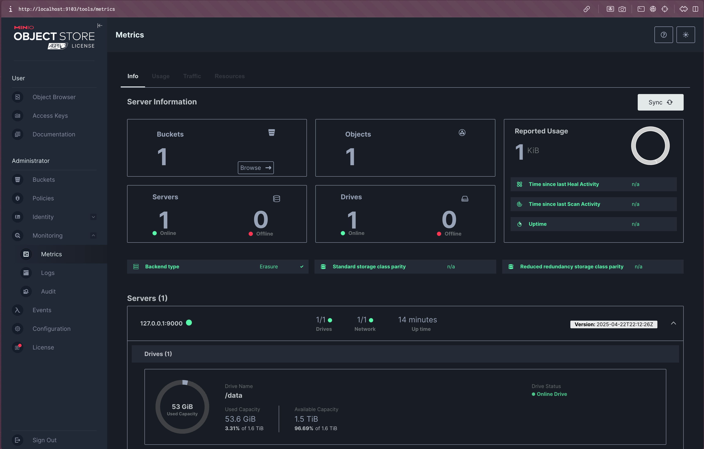

### 8. Проверка, что объект загрузился в бакет

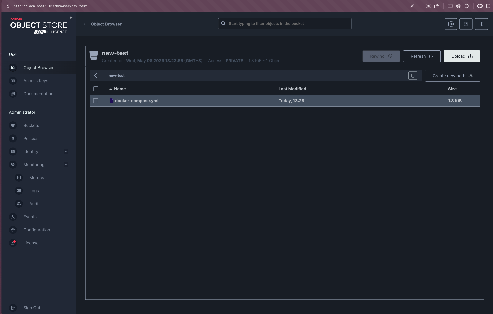


## Что можно улучшить

- добавить загрузку файлов прямо из UI
- добавить удаление бакетов и объектов
- добавить авторизацию и роли пользователей
- добавить лимиты ресурсов на инстанс
- добавить сбор метрик и health monitoring через Prometheus Grafana
