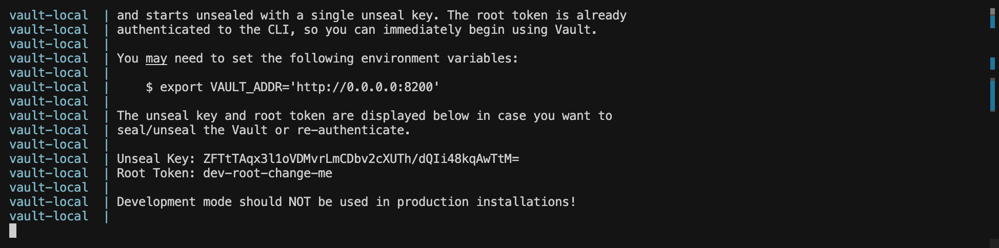
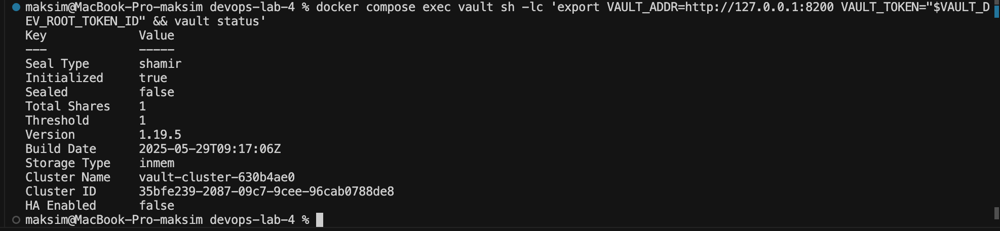
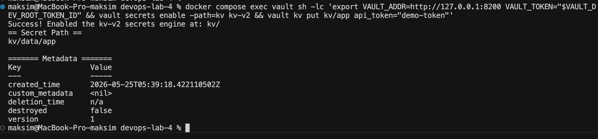
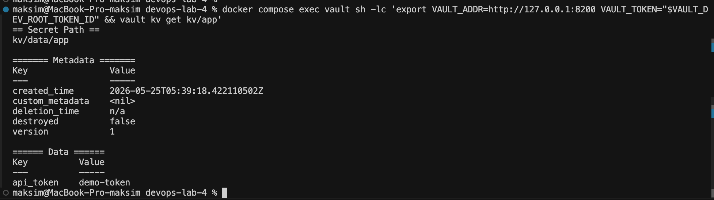

# Лабораторная работа 4 - CI/CD

## Часть 1 - Плохой и хороший CI/CD

### Описание пайплайна

Пайплайн состоит из пяти этапов:

- **prepare** - создание исходных файлов проекта (src, tests, requirements.txt) и загрузка их как артефакта
- **lint** - статический анализ кода утилитой ruff
- **test** - запуск тестов через pytest
- **build** - сборка zip-архива и генерация SHA-256 контрольной суммы
- **deploy** - деплой с проверкой контрольной суммы, только с ветки main

---

### Плохие практики и их исправления

#### 1. Плавающие версии экшенов (`@main`)

**Как в плохом файле:**

```yaml
uses: actions/checkout@main
uses: actions/upload-artifact@main
uses: actions/download-artifact@main
```

**Почему плохо:** тег `@main` ссылается на последний коммит ветки main в репозитории экшена. Авторы могут в любой момент выкатить изменения, которые сломают пайплайн без каких-либо предупреждений. Помимо этого, `upload-artifact` и `download-artifact` - разные репозитории, и при `@main` мажорные версии могут разойтись, что приводит к несовместимости внутреннего протокола передачи артефактов

**Как исправлено:**

```yaml
uses: actions/checkout@v5
uses: actions/upload-artifact@v7
uses: actions/download-artifact@v7
```

**Эффект:** пайплайн всегда использует одну и ту же версию экшена. Обновление становится осознанным решением разработчика, а не случайным событием при очередном запуске

---

#### 2. Избыточные права доступа (`write-all`)

**Как в плохом файле:**

```yaml
permissions: write-all
```

**Почему плохо:** GITHUB_TOKEN получает права на запись ко всем ресурсам репозитория: содержимому, PR, issues, packages и т.д. Если в пайплайне используется сторонний экшен со скрытой вредоносной логикой или происходит компрометация токена, злоумышленник получает полный контроль над репозиторием

**Как исправлено:**

```yaml
permissions:
  contents: read
```

**Эффект:** соблюдение принципа минимальных привилегий. Пайплайн может только читать содержимое репозитория - и ничего сверх того, что реально нужно для работы

---

#### 3. Непривязанная версия Python (`3.x`)

**Как в плохом файле:**

```yaml
python-version: "3.x"
```

**Почему плохо:** `3.x` означает "последняя доступная версия Python 3". При выходе новой минорной версии (например, переход с 3.12 на 3.13) поведение стандартной библиотеки и некоторых пакетов может измениться. Пайплайн будет давать разные результаты в зависимости от даты запуска

**Как исправлено:**

```yaml
python-version: "3.12"
```

**Эффект:** окружение воспроизводимо. Пайплайн одинаково работает сегодня, завтра и через полгода

---

#### 4. Игнорирование ошибок через `continue-on-error`

**Как в плохом файле:**

```yaml
- name: Install and lint (monolithic)
  continue-on-error: true

- name: Install and run tests
  continue-on-error: true
```

**Почему плохо:** `continue-on-error: true` позволяет пайплайну продолжать выполнение даже если линтер нашел нарушения или тесты упали. В итоге код с ошибками спокойно проходит до этапа деплоя. Пайплайн теряет свою главную функцию - быть воротами качества

**Как исправлено:** директива `continue-on-error` полностью убрана. При ошибке в любом шаге джоб завершается с ошибкой, следующий этап не запускается

**Эффект:** пайплайн корректно выполняет роль quality gate - код с ошибками не проходит в следующий этап

---

#### 5. Деплой при любом исходе (`if: always()`)

**Как в плохом файле:**

```yaml
deploy:
  needs: build
  if: always()
```

**Почему плохо:** `always()` запускает деплой вне зависимости от того, прошли ли предыдущие этапы успешно. Код, у которого не прошли тесты или линтер, окажется в production. Это прямая дорога к инцидентам

**Как исправлено:**

```yaml
deploy:
  needs: build
  if: github.ref == 'refs/heads/main'
```

**Эффект:** деплой выполняется только при успешном завершении всей цепочки этапов и только с ветки main. Случайная отправка в main тоже не приведет к деплою, если где-то упали тесты

---

#### 6. Отсутствие таймаута на джобах

**Как в плохом файле:** ни один джоб не содержит директивы `timeout-minutes`

**Почему плохо:** если джоб завис (например, тест попал в бесконечный цикл или зависла сеть при установке зависимостей), GitHub Actions будет ждать до достижения системного лимита в 6 часов. Это расходует оплаченные минуты раннера и блокирует очередь запусков

**Как исправлено:**

```yaml
jobs:
  prepare:
    timeout-minutes: 10
  lint:
    timeout-minutes: 10
```

**Эффект:** зависший джоб автоматически отменяется через 10 минут, освобождая ресурсы

---

#### 7. Отсутствие кеширования зависимостей

**Как в плохом файле:** в каждом джобе зависимости устанавливаются заново

```bash
python -m pip install --upgrade pip
pip install -r requirements.txt
```

**Почему плохо:** при каждом запуске пайплайна все пакеты скачиваются и устанавливаются с нуля. На больших проектах это добавляет минуты к каждому прогону и создает лишнюю нагрузку на PyPI

**Как исправлено:** в хорошем файле используется виртуальное окружение с кешем

```yaml
- name: Restore virtualenv cache
  id: venv-cache
  uses: actions/cache@v5
  with:
    path: .venv
    key: venv-${{ runner.os }}-py312-${{ hashFiles('requirements.txt') }}

- name: Create venv and install dependencies
  if: steps.venv-cache.outputs.cache-hit != 'true'
  run: |
    python -m venv .venv
    .venv/bin/pip install -r requirements.txt
```

**Эффект:** при повторных запусках с теми же зависимостями шаг установки пропускается полностью. Время сборки сокращается в разы

---

#### 8. Непривязанные версии зависимостей

**Как в плохом файле:**

```
pytest
ruff
```

**Почему плохо:** pip установит последние доступные версии пакетов на момент запуска. Новая версия pytest или ruff может изменить правила форматирования или поведение, что приведет к неожиданным падениям пайплайна

**Как исправлено:**

```
pytest==8.3.3
ruff==0.6.9
```

**Эффект:** окружение полностью воспроизводимо. Обновление версий пакетов - осознанное решение, которое отражается в коде

---

#### 9. Отсутствие проверки целостности артефакта

**Как в плохом файле:** build-этап просто создает архив без контрольной суммы, deploy-этап никак не верифицирует то, что получил

**Почему плохо:** нет никакой гарантии, что артефакт, который разворачивается на деплое, идентичен тому, что был собран на build-этапе. Теоретически возможна подмена или повреждение

**Как исправлено:** на build-этапе генерируется SHA-256 хеш

```bash
shasum -a 256 app-good.zip > app-good.sha256
```

На deploy-этапе хеш проверяется перед деплоем

```bash
shasum -a 256 -c app-good.sha256
```

**Эффект:** деплой не произойдет, если артефакт был поврежден или подменен

---

## Часть 2 - Работа с секретами через HashiCorp Vault

### Архитектура решения

```
GitHub Actions
     |
     | 1. Запрашивает OIDC JWT у GitHub
     v
GitHub OIDC Provider
     |
     | 2. Выдает подписанный JWT (claims: repo, branch, workflow)
     v
GitHub Actions
     |
     | 3. Отправляет JWT на /v1/auth/jwt/login
     v
HashiCorp Vault (JWT Auth Method)
     |
     | 4. Проверяет подпись, сравнивает claims с настроенной ролью
     | 5. Выдает временный client_token (TTL 10 минут)
     v
GitHub Actions
     |
     | 6. Читает секрет из KV с помощью client_token
     v
Vault KV (kv/data/app)
     |
     | 7. Возвращает значение api_token
     v
GitHub Actions
     |
     | 8. Маскирует значение через ::add-mask::
     | 9. Передает в шаг только через переменную окружения
```

### Почему этот подход красивый

**OIDC без статичных секретов** - пайплайн не хранит никаких долгоживущих токенов для доступа к Vault. Аутентификация происходит через GitHub OIDC, где GitHub сам выдает подписанный JWT для конкретного репозитория, ветки и воркфлоу. Добавить такой токен в переменные репозитория физически невозможно - он живет только в рамках одного запуска

**Минимальные привилегии в Vault** - роль в Vault настроена только на чтение конкретного пути (`kv/data/app`). Даже при утечке client_token злоумышленник не получит доступ к другим секретам

**Временные токены** - client_token живет 10 минут и привязан к сессии. После завершения пайплайна он становится неактивным автоматически

**Маскировка на всех уровнях** - JWT, Vault-токен и сам секрет добавляются в маску через `::add-mask::` сразу после получения. GitHub Actions заменяет любое их появление в логах на `***`

**Секрет не интерполируется в shell напрямую** - значение передается в следующий шаг только через переменную окружения `env:`. Это исключает случайный вывод через `echo` или трейсбек

**Централизованный аудит** - Vault пишет подробный audit log для каждого обращения: когда, каким воркфлоу и что именно было прочитано

---

### Почему хранение секретов в переменных CI/CD - не лучшая практика

**Статичные долгоживущие секреты** - секрет в GitHub Secrets живет до тех пор, пока его не удалят вручную. Чем дольше существует секрет, тем выше вероятность его компрометации через утечку, фишинг или смену сотрудника

**Нет централизованного управления** - если один и тот же API-ключ используется в 10 репозиториях, его ротация требует ручного обновления в каждом из них. Это ошибкоемко и часто приводит к тому, что в части репозиториев остается старый, потенциально скомпрометированный ключ

**Нет аудита использования** - GitHub не предоставляет детализированного аудита: когда конкретный секрет был использован, каким джобом, и было ли это использование ожидаемым. В случае инцидента невозможно точно установить масштаб утечки

**Привязка к платформе** - секреты живут только в GitHub. При переходе на другой CI/CD (GitLab CI, Jenkins, Woodpecker) все секреты придется мигрировать вручную. Vault является платформо-независимым хранилищем - любой CI/CD может обращаться к нему по API

**Риск при компрометации GitHub-токена** - скомпрометированный персональный токен GitHub с правами `admin:read` дает доступ к списку секретов через API. Vault требует отдельной аутентификации и авторизации, независимой от GitHub

**Отсутствие динамических секретов** - GitHub Secrets хранит только статичные значения. Vault умеет генерировать динамические секреты (например, временные credentials для базы данных), которые автоматически отзываются после использования - это принципиально более безопасный подход

---

### Как я запускал и проверял Vault локально

Для локальной проверки я поднимал Vault через Docker Compose из файла `docker-compose.yml`:

```bash
cp .env.example .env
docker compose up --build
```



После запуска я проверял, что Vault действительно поднялся и находится в рабочем состоянии:

```bash
docker compose exec vault sh -lc 'export VAULT_ADDR=http://127.0.0.1:8200 VAULT_TOKEN="$VAULT_DEV_ROOT_TOKEN_ID" && vault status'
```



Дальше я включал KV v2 на пути `kv` и записывал тестовый секрет, который потом читает workflow:

```bash
docker compose exec vault sh -lc 'export VAULT_ADDR=http://127.0.0.1:8200 VAULT_TOKEN="$VAULT_DEV_ROOT_TOKEN_ID" && vault secrets enable -path=kv kv-v2 && vault kv put kv/app api_token="demo-token"'
```



После этого я отдельно проверял, что секрет действительно читается из `kv`:

```bash
docker compose exec vault sh -lc 'export VAULT_ADDR=http://127.0.0.1:8200 VAULT_TOKEN="$VAULT_DEV_ROOT_TOKEN_ID" && vault kv get kv/app'
```




### Важное ограничение локального запуска

В моем случае Vault был запущен локально на машине, внутри Docker, поэтому `GitHub Actions` не сможет обратиться к нему напрямую по `localhost` или `127.0.0.1`

Из-за этого текущий workflow не заработает из коробки, пока Vault не станет доступен извне
