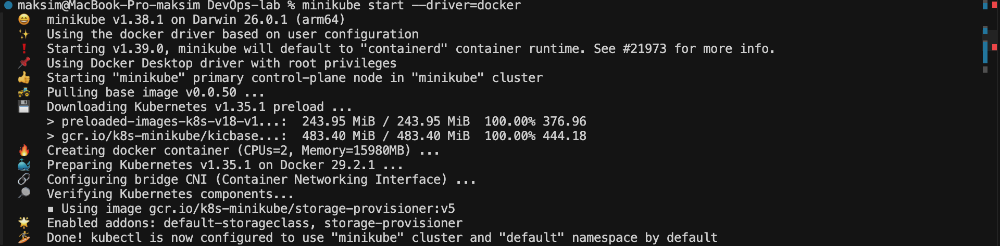
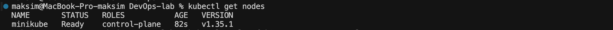
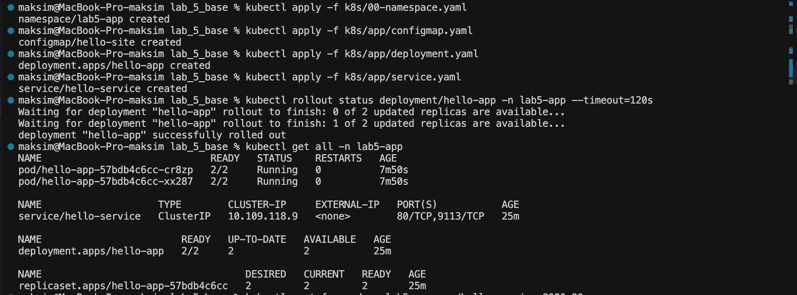
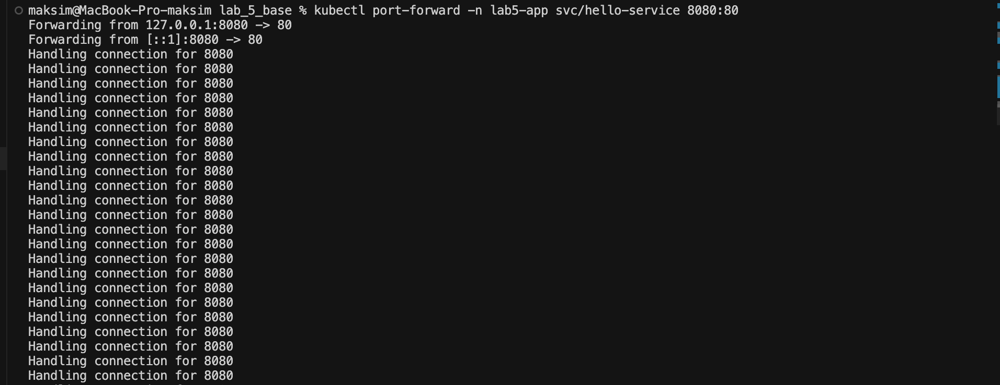
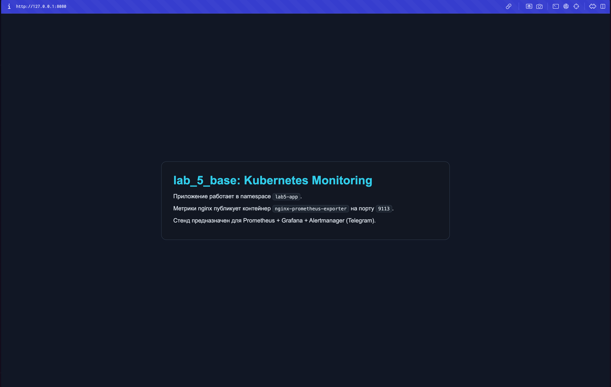
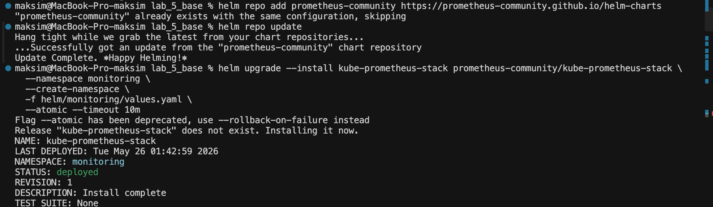
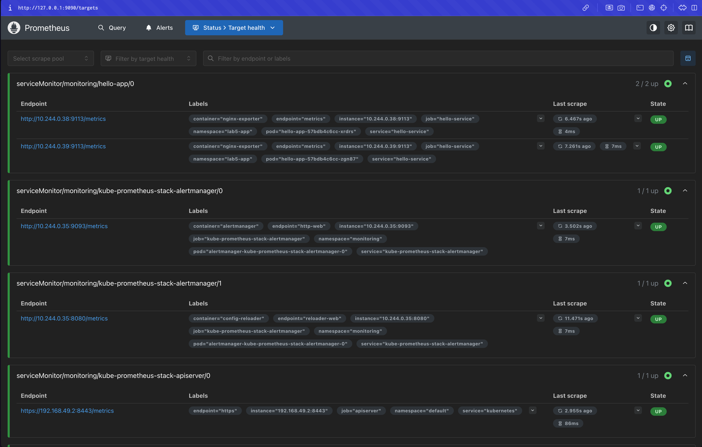
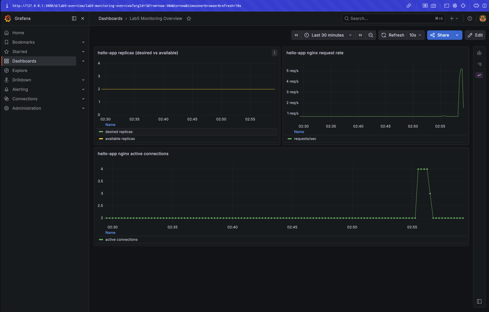
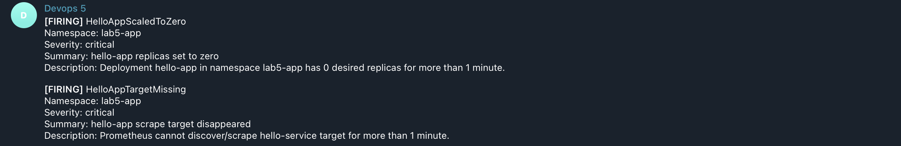

# Лабораторная работа 5 - Мониторинг сервиса в Kubernetes

## Цель работы

В этой работе я настроил мониторинг сервиса, развернутого в Kubernetes, через Prometheus и Grafana

В дополнительной части со звездочкой я настроил алерты кодом (IaC) через PrometheusRule и Alertmanager, показал их срабатывание и отправку уведомлений в Telegram

## Что было сделано

- Развернул приложение `hello-app` в namespace `lab5-app`
- Подключил сбор метрик через `nginx-prometheus-exporter` и `ServiceMonitor`
- Установил стек `kube-prometheus-stack` с Prometheus, Grafana и Alertmanager
- Добавил дашборд Grafana как IaC в `monitoring/grafana/dashboards/lab5-overview.json`
- Описал правила алертов кодом в `monitoring/prometheus/rules/app-alerts.yaml`
- Подключил Telegram receiver через конфигурацию Alertmanager и Kubernetes Secret

## Структура файлов проекта

- `k8s/00-namespace.yaml` - namespace приложения
- `k8s/app/configmap.yaml` - html-страница и конфигурация nginx
- `k8s/app/deployment.yaml` - deployment приложения и экспортера метрик
- `k8s/app/service.yaml` - service для http и metrics
- `k8s/app/servicemonitor.yaml` - подключение метрик приложения в Prometheus
- `helm/monitoring/values.yaml` - параметры установки мониторинг-стека
- `monitoring/prometheus/rules/app-alerts.yaml` - правила алертов Prometheus
- `monitoring/alertmanager/alertmanager.yaml` - конфигурация маршрутизации Alertmanager
- `monitoring/grafana/dashboards/lab5-overview.json` - дашборд Grafana
- `scripts/create-telegram-secret.sh` - создание Kubernetes Secret для Telegram
- `scripts/apply-grafana-dashboard.sh` - применение дашборда как ConfigMap
- `scripts/deploy-all.sh` - запуск полного деплоя стенда
- `scripts/trigger-alert.sh` - демонстрация срабатывания алерта

## Этап 1 - запуск кластера

Запустил Minikube и проверил состояние node.

```bash
minikube start --driver=docker
kubectl get nodes
```





## Этап 2 - деплой приложения

Далее я развернул `hello-app` в отдельном namespace `lab5-app`.

```bash
kubectl apply -f k8s/00-namespace.yaml
kubectl apply -f k8s/app/configmap.yaml
kubectl apply -f k8s/app/deployment.yaml
kubectl apply -f k8s/app/service.yaml
kubectl rollout status deployment/hello-app -n lab5-app --timeout=120s
kubectl get all -n lab5-app
```

Доступность приложения проверил через `port-forward`.

```bash
kubectl port-forward -n lab5-app svc/hello-service 8080:80
```







## Этап 3 - установка стека мониторинга

Сначала создал Secret с конфигурацией для Alertmanager, в которой лежат данные Telegram.

```bash
bash scripts/create-telegram-secret.sh
kubectl get secret alertmanager-telegram-config -n monitoring
```

Затем установил `kube-prometheus-stack` через Helm.

```bash
helm repo add prometheus-community https://prometheus-community.github.io/helm-charts
helm repo update
helm upgrade --install kube-prometheus-stack prometheus-community/kube-prometheus-stack \
  --namespace monitoring \
  --create-namespace \
  -f helm/monitoring/values.yaml \
  --rollback-on-failure --timeout 10m
```

После установки проверил список pods и services в namespace `monitoring`.

```bash
kubectl get pods -n monitoring
kubectl get svc -n monitoring
```



## Этап 4 - подключение метрик и проверка Targets

На этом шаге применил `ServiceMonitor`, правила алертов и дашборд Grafana.

```bash
kubectl apply -f k8s/app/servicemonitor.yaml
kubectl apply -f monitoring/prometheus/rules/app-alerts.yaml
bash scripts/apply-grafana-dashboard.sh
```

Для проверки Targets в Prometheus поднял `port-forward`.

```bash
kubectl -n monitoring port-forward svc/kube-prometheus-stack-prometheus 9090:9090
```

В интерфейсе Prometheus по адресу `http://127.0.0.1:9090` проверил статус `UP` для таргета `hello-app`.



## Этап 5 - проверка графиков в Grafana

Для доступа к Grafana поднял `port-forward`.

```bash
kubectl -n monitoring port-forward svc/kube-prometheus-stack-grafana 3000:80
```

Grafana была доступна по адресу `http://127.0.0.1:3000`, логин и пароль по умолчанию - `admin`.

Открыл дашборд `Lab5 Monitoring Overview`. Чтобы на графиках появились данные, я сгенерировал нагрузку на сервис.

```bash
kubectl -n lab5-app port-forward svc/hello-service 8080:80
```

```bash
for i in $(seq 1 200); do
  curl -sS http://127.0.0.1:8080/ >/dev/null
done
```

Два рабочих графика:

- `hello-app replicas (desired vs available)` - показывает соотношение желаемых и доступных реплик
- `hello-app nginx request rate` - показывает количество входящих запросов в секунду

Дополнительно график `hello-app nginx active connections`.



## Этап 6 - настройка алертов как IaC

Все правила алертов описал кодом в файле `monitoring/prometheus/rules/app-alerts.yaml`. Там задал три правила:

- `HelloAppScaledToZero` (уровень `critical`) - срабатывает, когда количество реплик падает до нуля
- `HelloAppUnavailable` (уровень `warning`) - срабатывает, когда доступных реплик меньше желаемого
- `HelloAppTargetMissing` (уровень `critical`) - срабатывает, когда таргет пропадает из Prometheus


## Этап 7 - демонстрация срабатывания алерта

Для демонстрации запустил готовый скрипт:

```bash
bash scripts/trigger-alert.sh
```

Скрипт масштабирует `hello-app` до нуля реплик, ждет появления статуса `Firing` и возвращает реплики в рабочее состояние

